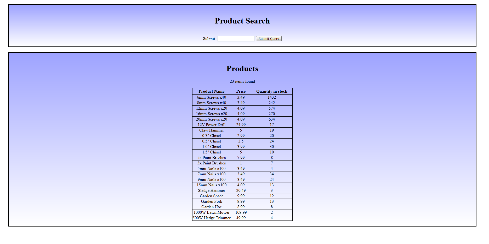

# SQL Webserver Database (Allows for SQL Injections):

This is PHP code designed on a LAMP stack that implements an interactive SQL database on a webserver.
The PHP code allows for the demostration of an SQL Injection.

This project is based off of Computerphile's *Running an SQL Injection Attack - Computerphile*, which can be viewed at: https://youtu.be/ciNHn38EyRc

This PHP code was built using a MariaDB SQL database.

Made through Fedora
